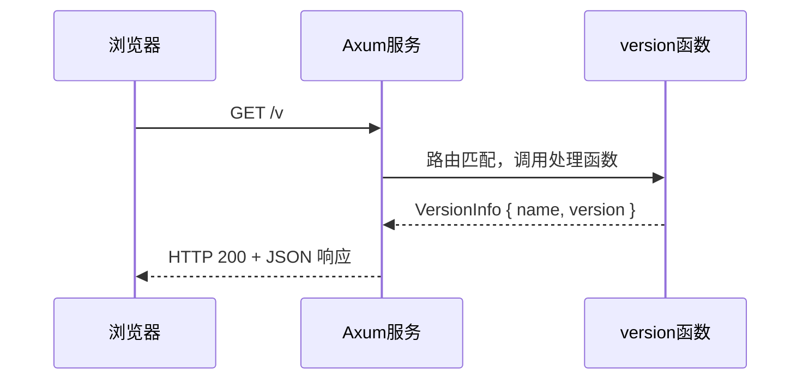

# 第一个 Axum 接口：/v 系统版本信息

> 面向零基础新手的完整指导，从安装环境到跑通第一个接口

---

## 一、你将得到什么

运行完本文档的步骤后，你会拥有一个本地运行的 HTTP 服务，访问它会返回：

```json
{
  "name": "IM Server",
  "version": "0.1.0"
}
```

终端里会打印出可以直接点击访问的地址：

```
服务已启动 → http://192.168.1.100:3000
本机访问  → http://127.0.0.1:3000
版本接口  → http://127.0.0.1:3000/v
```

---

## 二、安装 Rust 环境

如果你从没用过 Rust，先装它。只需要一条命令：

```bash
curl --proto '=https' --tlsv1.2 -sSf https://sh.rustup.rs | sh
```

安装过程中遇到选项，直接按回车选默认就好。

安装完成后，**关闭终端重新打开**，然后验证：

```bash
rustc --version
cargo --version
```

看到版本号就说明装好了，比如：

```
rustc 1.77.0
cargo 1.77.0
```

> Rust 自带包管理器 `cargo`，类似 Node.js 的 `npm`，后面所有操作都通过它完成。

---

## 三、项目结构说明

```
server/
├── Cargo.toml      # 项目配置 + 依赖声明（类似 package.json）
└── src/
    └── main.rs     # 程序入口，所有代码在这里
```

就这两个文件，非常简单。

---

## 四、代码解读

### Cargo.toml — 依赖配置

```toml
[package]
name = "server"
version = "0.1.0"
edition = "2021"

[dependencies]
axum = "0.7"                              # Web 框架
tokio = { version = "1", features = ["full"] }  # 异步运行时
serde = { version = "1", features = ["derive"] } # 序列化工具
serde_json = "1"                          # JSON 支持
local-ip-address = "0.6"                  # 获取本机 IP
```

类比理解：
- `axum` = Express.js（Node.js 的 Web 框架）
- `tokio` = Node.js 的事件循环（Rust 需要手动引入）
- `serde` = JSON.stringify / JSON.parse

### main.rs — 核心代码

```rust
use axum::{routing::get, Json, Router};
use local_ip_address::local_ip;
use serde::Serialize;
```

`use` 相当于其他语言的 `import`，把需要用的东西引入进来。

---

```rust
#[derive(Serialize)]
struct VersionInfo {
    name: &'static str,
    version: &'static str,
}
```

定义了返回数据的结构。`#[derive(Serialize)]` 是一个"魔法标注"，加上它之后 Rust 会自动帮你把这个结构体转成 JSON，不需要手写转换代码。

---

```rust
async fn version() -> Json<VersionInfo> {
    Json(VersionInfo {
        name: "IM Server",
        version: env!("CARGO_PKG_VERSION"),
    })
}
```

这是接口的处理函数。`async fn` 表示异步函数。`env!("CARGO_PKG_VERSION")` 会在编译时自动读取 `Cargo.toml` 里的 `version = "0.1.0"`，这样版本号只需要在一个地方维护。

---

```rust
#[tokio::main]
async fn main() {
    let port = 3000;
    let app = Router::new().route("/v", get(version));
    // ...
}
```

`Router::new().route("/v", get(version))` 的意思是：当有人用 GET 方法访问 `/v` 路径时，调用 `version` 函数处理。

---

## 五、运行项目

进入 server 目录，执行：

```bash
cd server
cargo run
```

第一次运行会下载依赖，需要等 1-3 分钟（取决于网速）。你会看到类似这样的输出：

```
   Compiling server v0.1.0
    Finished dev [unoptimized + debuginfo] target(s) in 8.5s
     Running `target/debug/server`
服务已启动 → http://192.168.1.100:3000
本机访问  → http://127.0.0.1:3000
版本接口  → http://127.0.0.1:3000/v
```

---

## 六、测试接口

### 方式一：浏览器直接访问

打开浏览器，输入：

```
http://127.0.0.1:3000/v
```

你会看到：

```json
{"name":"IM Server","version":"0.1.0"}
```

### 方式二：命令行 curl

```bash
curl http://127.0.0.1:3000/v
```

### 方式三：格式化输出（更好看）

```bash
curl http://127.0.0.1:3000/v | python3 -m json.tool
```

输出：

```json
{
    "name": "IM Server",
    "version": "0.1.0"
}
```

---

## 七、常见问题

**Q：`cargo run` 报错 "error: could not find `Cargo.toml`"**

你不在 `server` 目录里。执行 `cd server` 再试。

---

**Q：端口 3000 被占用，报错 "Address already in use"**

修改 `main.rs` 第 14 行，把 `3000` 改成其他端口，比如 `3001`：

```rust
let port = 3001;
```

---

**Q：下载依赖很慢**

配置国内镜像源。在 `~/.cargo/config.toml` 文件中添加（没有就新建）：

```toml
[source.crates-io]
replace-with = "rsproxy"

[source.rsproxy]
registry = "https://rsproxy.cn/crates.io-index"
```

---

**Q：如何停止服务？**

在终端按 `Ctrl + C`。

---

## 八、接口流程图



---

## 九、下一步

这个接口是整个 IM 后端的起点。接下来可以：

1. 添加 `/health` 健康检查接口
2. 引入 `tracing` 打印结构化日志
3. 添加数据库连接（sqlx + PostgreSQL）
4. 实现用户注册 / 登录接口

每一步都可以在现有代码基础上叠加，不需要推倒重来。
