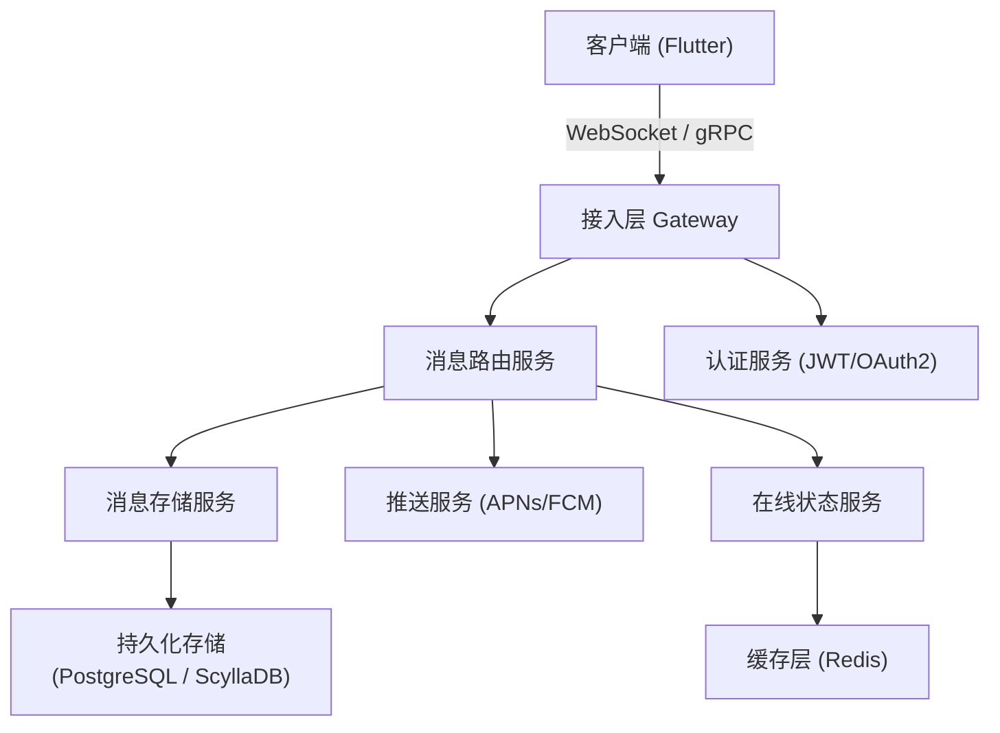
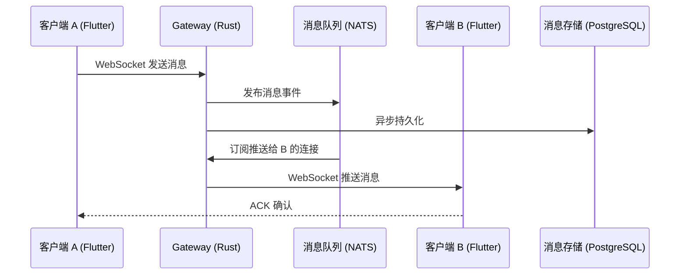
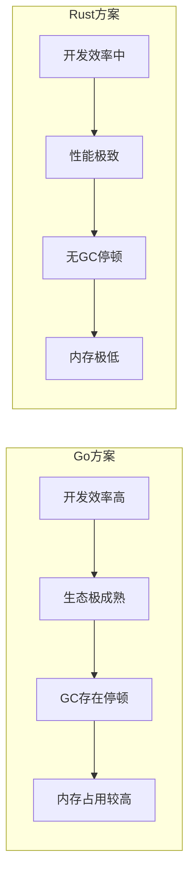
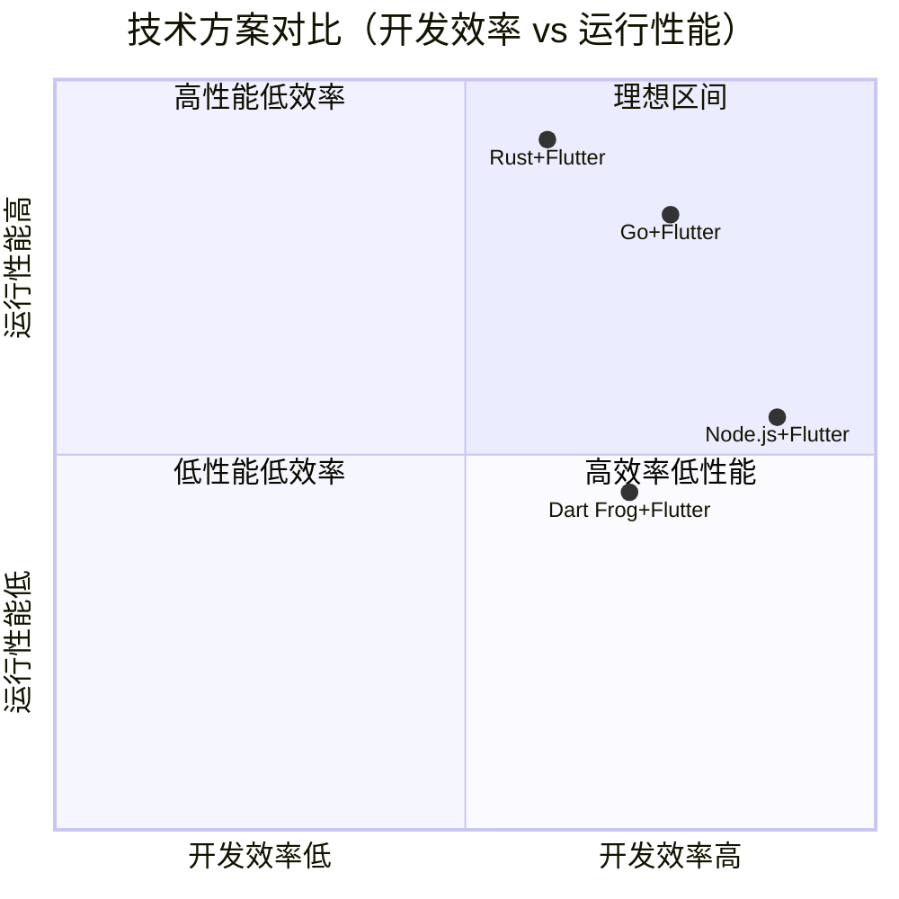
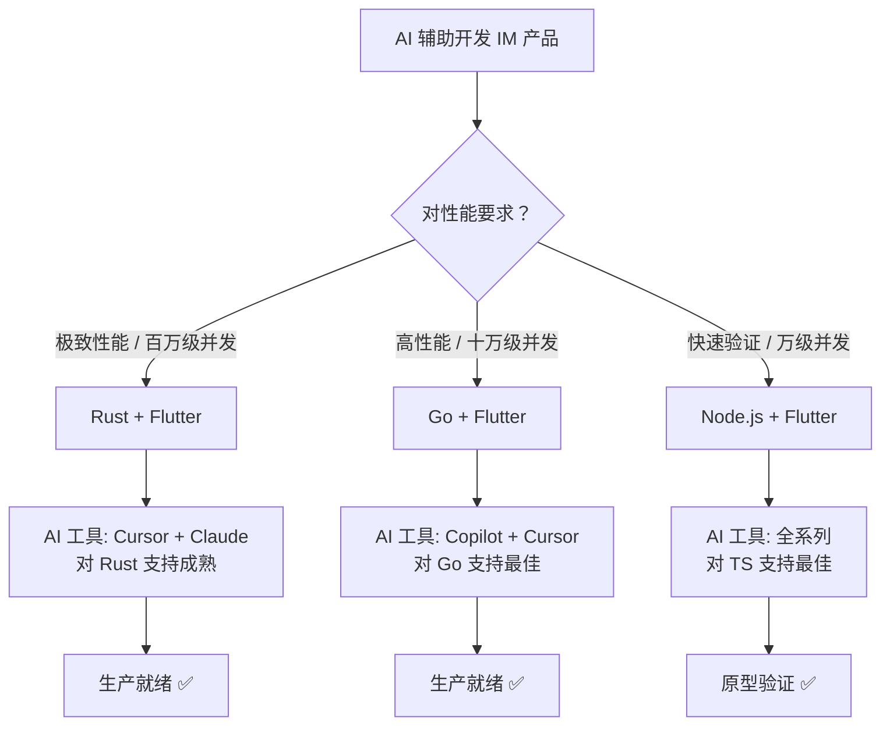

# 全栈全端 IM 即时通信产品技术方案评估报告

> 评估日期：2026-04-03  
> 背景：基于 AI 辅助编程，评估 Rust 后端 + Flutter 前端方案及其他技术方案的可行性

---

## 一、产品目标定义

IM 即时通信产品核心能力需求：

- 实时消息收发（文字、图片、文件、语音、视频）
- 单聊 / 群聊
- 消息持久化与历史记录
- 用户认证与好友关系管理
- 在线状态感知（presence）
- 推送通知（离线消息）
- 多端同步（iOS / Android / Web / Desktop）
- 可扩展性（支持百万级连接）

---

## 二、核心架构模型



---

## 三、方案一：Rust 后端 + Flutter 前端（主推方案）

### 3.1 技术栈

| 层级 | 技术选型 |
|------|----------|
| 后端框架 | Axum / Actix-Web |
| 实时通信 | Tokio + WebSocket (tokio-tungstenite) |
| RPC | tonic (gRPC) |
| 消息队列 | NATS / Kafka |
| 持久化 | PostgreSQL (sqlx) + ScyllaDB (消息流水) |
| 缓存 | Redis (在线状态、会话) |
| 前端 | Flutter 3.x |
| 状态管理 | Riverpod / Bloc |
| 实时通信客户端 | web_socket_channel / grpc-dart |
| 跨平台目标 | iOS / Android / Web / macOS / Windows / Linux |

### 3.2 消息收发流程



### 3.3 优势分析

**性能**
- Rust 零成本抽象 + Tokio 异步运行时，单机可支撑 10w+ 并发 WebSocket 连接
- 内存占用极低，无 GC 停顿，延迟稳定
- Flutter 编译为原生代码，UI 渲染性能接近原生

**AI 编程友好度**
- Rust 代码结构清晰，类型系统严格，AI 生成代码错误率低
- Flutter/Dart 语法简洁，AI 代码补全质量高
- 两者文档完善，AI 训练数据充足

**跨平台覆盖**
- Flutter 一套代码覆盖 6 个平台（iOS/Android/Web/macOS/Windows/Linux）
- Rust 后端可编译到任意服务器环境，支持容器化部署

**安全性**
- Rust 内存安全特性从语言层面消除大量安全漏洞
- 无空指针、无数据竞争，适合高安全要求的通信场景

### 3.4 挑战与应对

| 挑战 | 应对策略 |
|------|----------|
| Rust 学习曲线（借用检查器） | AI 辅助编程大幅降低门槛，Copilot/Cursor 对 Rust 支持成熟 |
| Rust 生态相对年轻 | 核心库（Tokio/Axum/sqlx）已非常稳定，IM 场景覆盖完整 |
| Flutter Web 性能 | IM Web 端需求相对简单，CanvasKit 渲染足够 |
| 端到端加密实现 | 使用 Signal Protocol 的 Rust 实现（libsignal） |

### 3.5 可行性评分

```mermaid
radar
    title 方案一综合评分（满分10）
    "性能" : 9
    "AI编程友好" : 8
    "跨平台覆盖" : 9
    "生态成熟度" : 7
    "开发效率" : 7
    "运维成本" : 8
```

> 综合评分：**8.0 / 10** — 高度推荐，尤其适合追求极致性能和长期维护的产品

---

## 四、方案二：Go 后端 + Flutter 前端

### 4.1 技术栈

| 层级 | 技术选型 |
|------|----------|
| 后端框架 | Go + Gin / Fiber / Go-Zero |
| 实时通信 | gorilla/websocket |
| 消息队列 | Kafka / RocketMQ |
| 持久化 | MySQL + MongoDB |
| 前端 | Flutter 3.x（同方案一） |

### 4.2 与方案一对比



| 维度 | Go + Flutter | Rust + Flutter |
|------|-------------|----------------|
| 性能 | 优秀 | 极致 |
| 开发效率 | 高 | 中（AI辅助后接近高） |
| 生态成熟度 | 非常成熟 | 成熟 |
| AI 编程支持 | 极好 | 好 |
| 内存占用 | 中 | 极低 |
| 运维复杂度 | 低 | 低 |
| 综合评分 | 8.2 / 10 | 8.0 / 10 |

> Go 方案在 AI 编程场景下开发效率略高，是 Rust 方案的有力竞争者。

---

## 五、方案三：Node.js (TypeScript) 后端 + Flutter 前端

### 5.1 技术栈

| 层级 | 技术选型 |
|------|----------|
| 后端框架 | NestJS / Fastify |
| 实时通信 | Socket.IO / ws |
| 消息队列 | Redis Pub/Sub / Kafka |
| 持久化 | PostgreSQL + MongoDB |
| 前端 | Flutter 3.x |

### 5.2 评估

| 维度 | 评分 |
|------|------|
| 性能 | 6/10（单线程，高并发需集群） |
| 开发效率 | 9/10（AI 对 TS 支持最好） |
| 生态成熟度 | 10/10 |
| AI 编程支持 | 10/10 |
| 内存占用 | 5/10（V8 引擎较重） |
| 综合评分 | 7.5 / 10 |

> 适合快速原型验证，不适合追求高并发性能的生产级 IM。

---

## 六、方案四：全 Dart 方案（Dart Frog 后端 + Flutter 前端）

### 6.1 概述

使用 Dart Frog 作为后端框架，与 Flutter 共享代码（模型、工具类、协议定义）。

### 6.2 评估

| 维度 | 评分 |
|------|------|
| 代码复用率 | 9/10（前后端共享 Dart 代码） |
| 性能 | 6/10（Dart VM 性能有限） |
| 生态成熟度 | 5/10（Dart 服务端生态较弱） |
| AI 编程支持 | 7/10 |
| 综合评分 | 6.5 / 10 |

> 适合小规模团队快速验证，不推荐用于生产级高并发场景。

---

## 七、方案横向对比总览



| 方案 | 性能 | 开发效率 | 生态 | AI友好 | 跨平台 | 综合 |
|------|------|----------|------|--------|--------|------|
| Rust + Flutter | ★★★★★ | ★★★★ | ★★★★ | ★★★★ | ★★★★★ | 8.0 |
| Go + Flutter | ★★★★ | ★★★★★ | ★★★★★ | ★★★★★ | ★★★★★ | 8.2 |
| Node.js + Flutter | ★★★ | ★★★★★ | ★★★★★ | ★★★★★ | ★★★★★ | 7.5 |
| Dart Frog + Flutter | ★★★ | ★★★★ | ★★★ | ★★★★ | ★★★★★ | 6.5 |

---

## 八、AI 编程视角下的特殊考量



在 AI 编程场景下，技术能力成本大幅降低，关键决策因素转变为：

1. AI 对该语言的代码生成质量（训练数据量）
2. 编译器 / 类型系统对 AI 错误的纠错能力（Rust > TypeScript > Go）
3. 调试和错误信息的可读性
4. 生态库的 AI 文档覆盖率

Rust 的严格类型系统实际上是 AI 编程的优势——编译器会精确指出 AI 生成代码的问题，形成高效的"AI 生成 → 编译器纠错 → AI 修复"闭环。

---

## 九、推荐结论

### 首选方案：Go 后端 + Flutter 前端

在 AI 辅助编程背景下，Go + Flutter 综合评分最高：
- Go 语言简洁，AI 代码生成质量极高
- 生态极其成熟（微信、字节跳动等大厂 IM 后端均使用 Go）
- 性能足以支撑绝大多数 IM 产品规模
- 运维简单，单二进制部署

### 次选方案：Rust 后端 + Flutter 前端

如果产品定位为：
- 极致低延迟（金融级、游戏级）
- 超大规模并发（千万级连接）
- 对内存和服务器成本极度敏感
- 安全性要求极高（端到端加密、零信任）

则 Rust + Flutter 是更优选择，AI 编程已足以弥补 Rust 的学习曲线。

### 不推荐

- Node.js 方案：高并发下性能瓶颈明显，不适合生产级 IM
- Dart Frog 方案：服务端生态过于薄弱，风险较高

---

## 十、参考资源

- [Tokio - Rust 异步运行时](https://tokio.rs)
- [Axum - Rust Web 框架](https://github.com/tokio-rs/axum)
- [Flutter 官方文档](https://flutter.dev)
- [Go-Zero - Go 微服务框架](https://go-zero.dev)
- [OpenIM - 开源 Go IM 服务端参考实现](https://github.com/openimsdk/open-im-server)
- [Matrix Protocol - 开放 IM 协议标准](https://matrix.org)
