# Rust 后端技术栈全景分析：面向 AI 辅助开发的 IM 系统

> 日期：2026-04-07  
> 目标：基于 AI 编程实现生产级 IM 后端，评估 Rust 生态现状及与其他技术栈的对比

---

## 一、Rust 后端生态现状概览

Rust 在后端领域已从"实验性"走向"生产可用"。2024-2026 年间，核心生态趋于稳定：

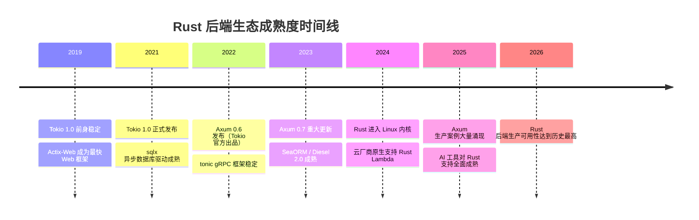

### 核心生态地图

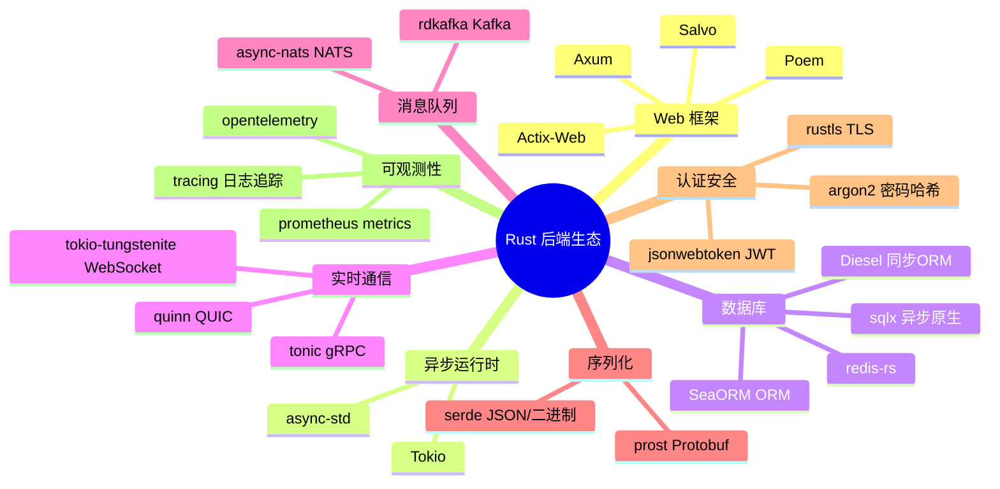

---

## 二、Web 框架横向对比

### 2.1 主流框架特性对比

| 框架 | 维护方 | 异步运行时 | 设计风格 | 生产成熟度 | AI 代码质量 |
|------|--------|-----------|----------|-----------|------------|
| Axum | Tokio 官方 | Tokio | 模块化、类型安全 | ★★★★★ | ★★★★★ |
| Actix-Web | 社区 | 自有 Actor | 高性能、宏驱动 | ★★★★★ | ★★★★ |
| Poem | 社区 | Tokio | 简洁、OpenAPI 友好 | ★★★★ | ★★★★ |
| Salvo | 社区 | Tokio | 简单易用 | ★★★ | ★★★ |

### 2.2 框架选型决策树

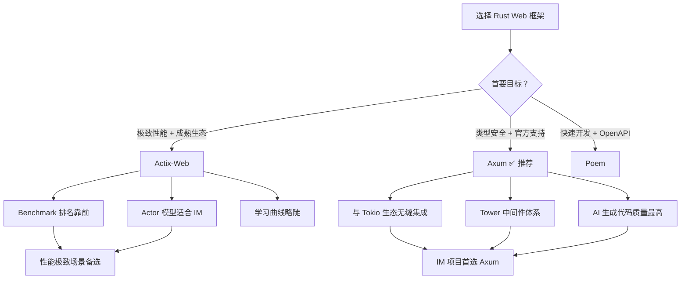

### 2.3 Axum vs Actix-Web 代码风格对比

Axum 风格（更符合 AI 生成习惯）：
```rust
// Axum：函数式，类型推导清晰
async fn send_message(
    State(state): State<AppState>,
    Json(payload): Json<SendMessageRequest>,
) -> Result<Json<MessageResponse>, AppError> {
    let msg = state.msg_service.send(payload).await?;
    Ok(Json(msg))
}
```

Actix-Web 风格：
```rust
// Actix-Web：宏驱动，性能更高
#[post("/messages")]
async fn send_message(
    data: web::Data<AppState>,
    payload: web::Json<SendMessageRequest>,
) -> impl Responder {
    // ...
}
```

---

## 三、IM 系统核心技术组件分析

### 3.1 实时通信层

IM 的核心是长连接，Rust 在这方面有天然优势。

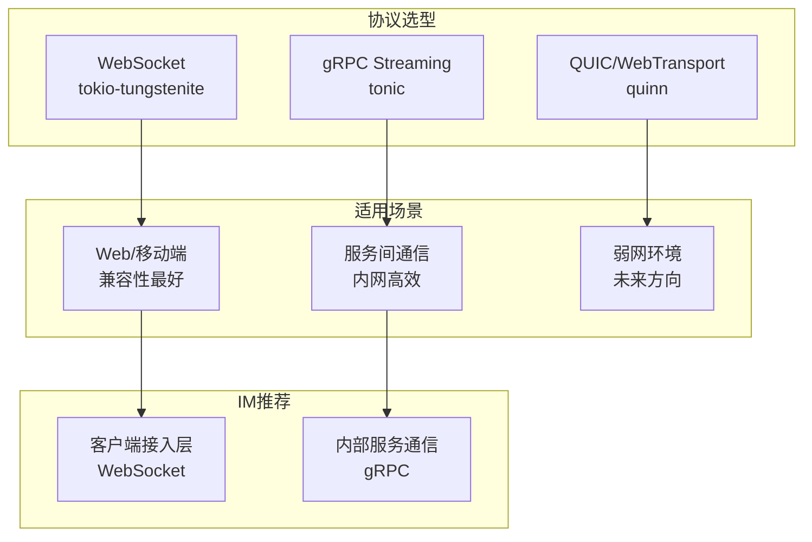

WebSocket 连接管理核心模式：
```rust
// 连接注册表：管理所有在线连接
type ConnRegistry = Arc<DashMap<UserId, mpsc::Sender<Message>>>;

// 每个连接独立 Tokio Task
tokio::spawn(async move {
    while let Some(msg) = ws_receiver.next().await {
        // 处理消息，路由转发
    }
});
```

### 3.2 消息队列选型

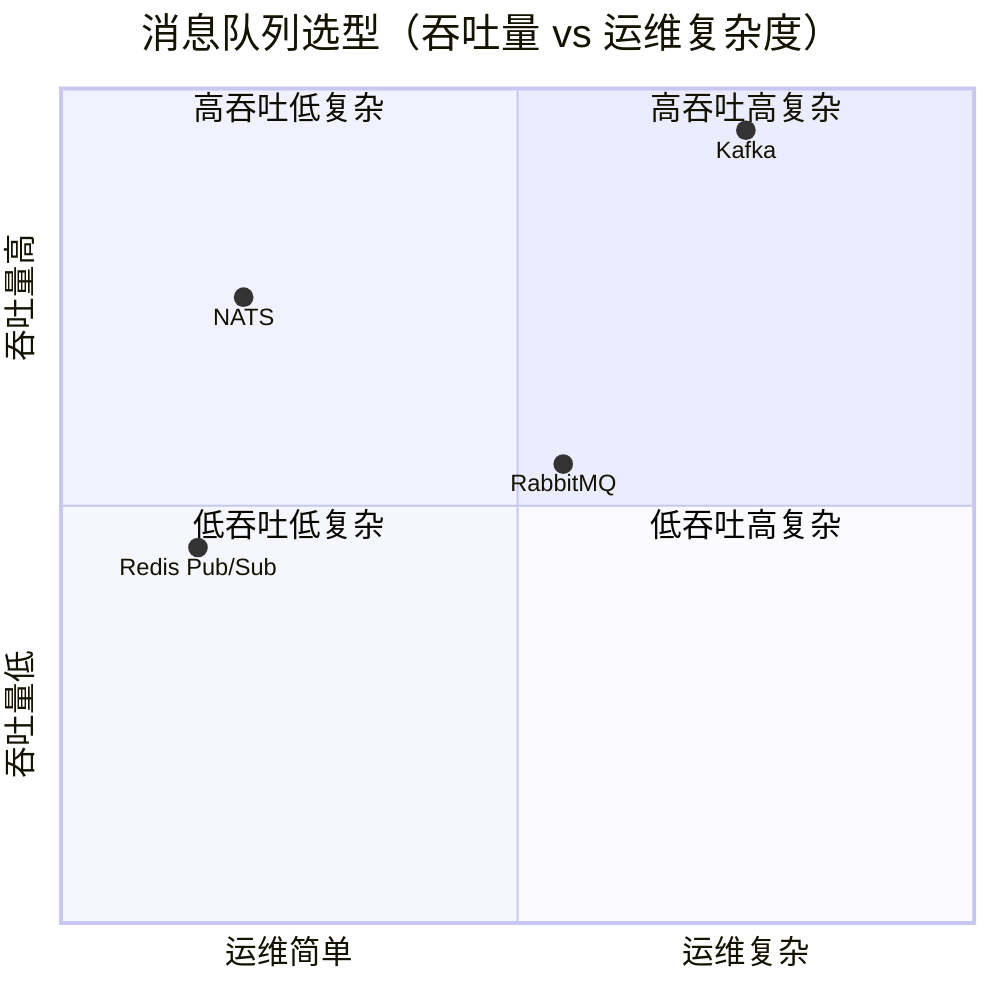

| 方案 | Rust 客户端 | 适用规模 | IM 推荐度 |
|------|------------|---------|----------|
| NATS (async-nats) | ✅ 官方支持 | 中大型 | ★★★★★ |
| Kafka (rdkafka) | ✅ 成熟 | 超大型 | ★★★★ |
| Redis Pub/Sub | ✅ redis-rs | 小中型 | ★★★ |

NATS 是 IM 场景的最佳平衡点：延迟低（微秒级）、运维简单、Rust 客户端官方维护。

### 3.3 数据库层

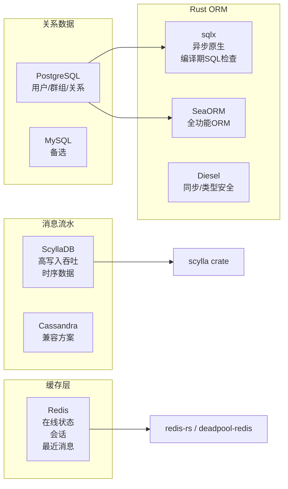

sqlx 的杀手级特性——编译期 SQL 检查：
```rust
// 编译时验证 SQL 语法和类型，AI 写错了编译器直接报错
let user = sqlx::query_as!(
    User,
    "SELECT id, name, email FROM users WHERE id = $1",
    user_id
)
.fetch_one(&pool)
.await?;
```

---

## 四、IM 系统完整架构设计

### 4.1 整体架构

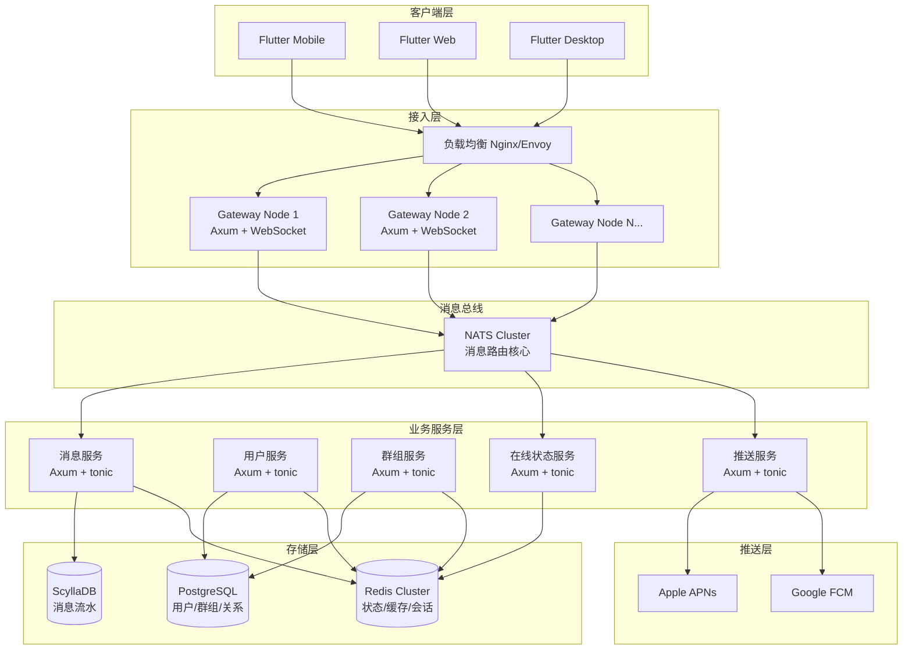

### 4.2 消息投递完整流程

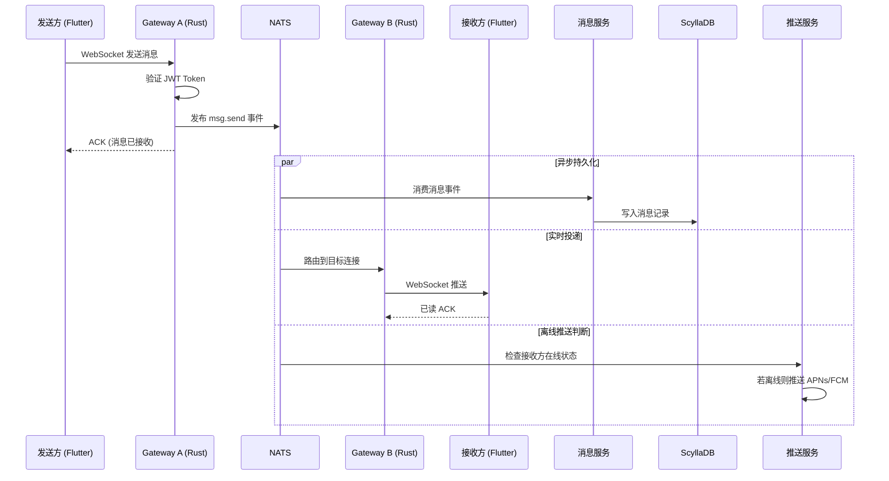

### 4.3 在线状态管理

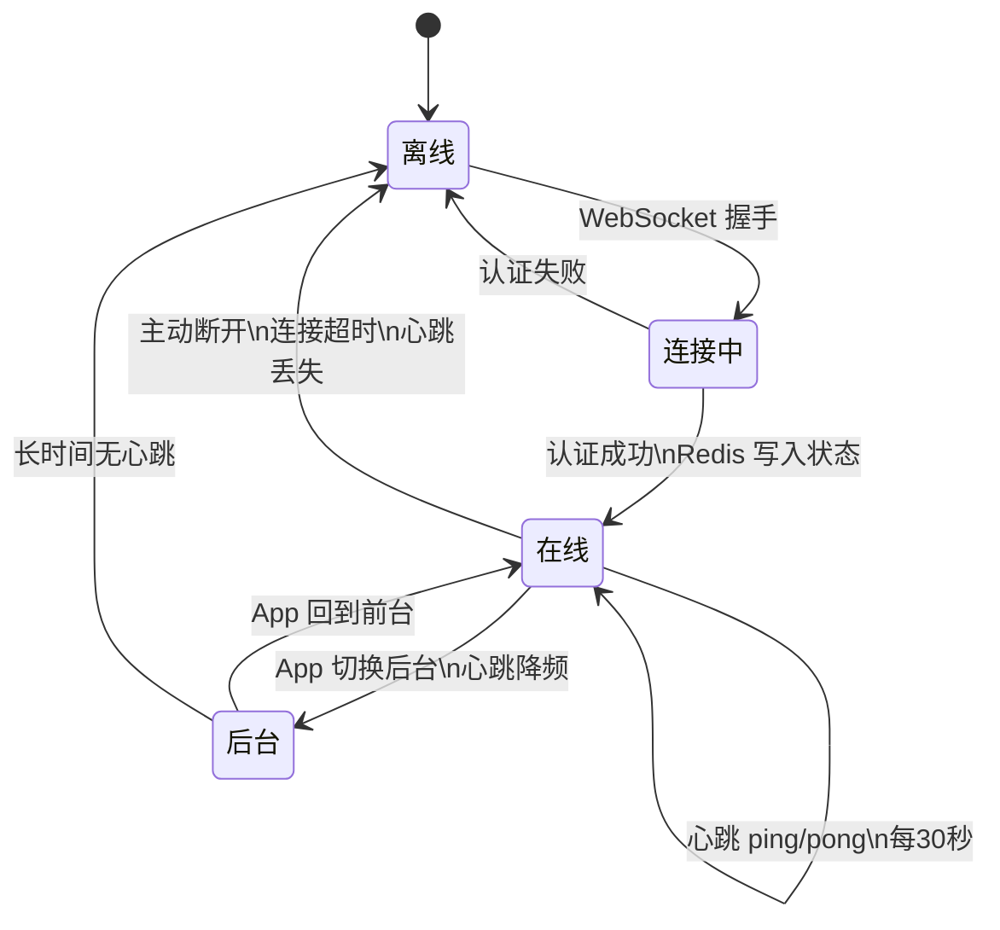

---

## 五、Rust vs 其他后端语言全面对比

### 5.1 性能基准

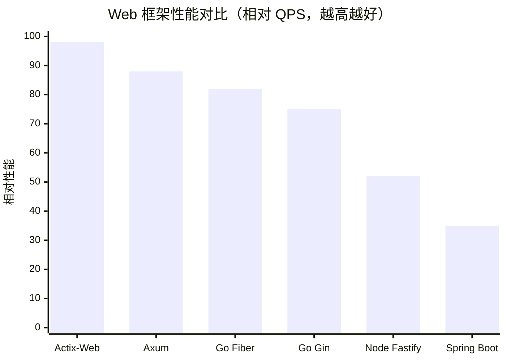

### 5.2 IM 场景关键维度对比

```mermaid
radar
    title IM 后端技术栈综合评分（满分10）
    "并发性能"
    "内存效率"
    "开发效率"
    "AI编程支持"
    "生态成熟度"
    "运维成本"
    "安全性"
    Rust-Axum
    Go-Gin
    Node-NestJS
    Java-Spring
```

| 维度 | Rust/Axum | Go/Gin | Node.js/NestJS | Java/Spring |
|------|-----------|--------|----------------|-------------|
| 并发性能 | 10 | 8 | 6 | 7 |
| 内存效率 | 10 | 7 | 5 | 4 |
| 开发效率（原生） | 6 | 9 | 9 | 7 |
| 开发效率（AI辅助） | 8 | 9 | 9 | 8 |
| AI 代码生成质量 | 8 | 9 | 9 | 8 |
| 生态成熟度 | 7 | 9 | 9 | 10 |
| 运维成本 | 9 | 9 | 7 | 6 |
| 安全性 | 10 | 8 | 6 | 7 |
| IM 场景综合 | **8.5** | **8.5** | 7.0 | 7.0 |

### 5.3 各语言 IM 生产案例

| 语言 | 知名 IM 案例 |
|------|------------|
| Go | 微信后台部分服务、字节跳动 IM、Discord 部分服务 |
| Rust | Discord 消息存储（从 Go 迁移到 Rust）、Cloudflare 网关 |
| Java | 钉钉、企业微信早期、大量企业 IM |
| Node.js | Slack 早期、Socket.IO 生态 |
| Erlang | WhatsApp（百亿级消息） |

> Discord 2020 年将消息存储从 Go 迁移到 Rust，内存降低 72%，延迟更稳定，是 Rust 在 IM 领域最著名的生产案例。

---

## 六、AI 辅助开发 Rust 后端的实践策略

### 6.1 AI + Rust 的协作闭环

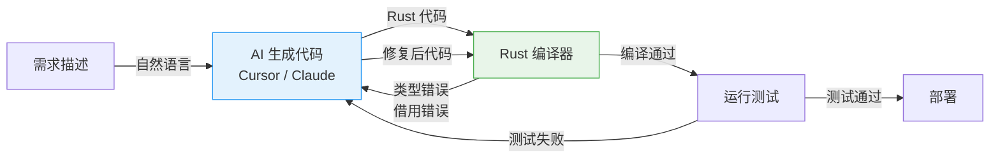

Rust 编译器是 AI 编程的"免费代码审查员"——它会精确指出 AI 生成代码的每一个问题，形成高效纠错闭环。这是 Go/Node.js 无法提供的优势。

### 6.2 推荐的 AI 工具链

| 工具 | 用途 | Rust 支持质量 |
|------|------|--------------|
| Cursor | 主力 IDE + AI 补全 | ★★★★★ |
| Claude 3.5+ | 复杂逻辑生成 | ★★★★★ |
| GitHub Copilot | 行内补全 | ★★★★ |
| rust-analyzer | LSP 语言服务 | ★★★★★ |

### 6.3 IM 项目推荐开发顺序

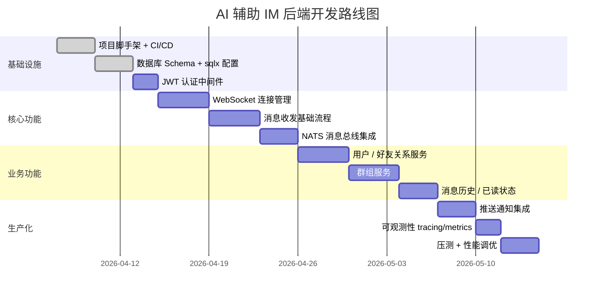

---

## 七、推荐技术栈清单

基于以上分析，面向 AI 辅助开发的 IM 后端推荐栈：

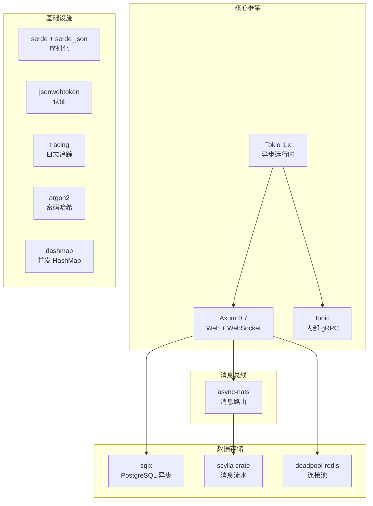

### Cargo.toml 核心依赖参考

```toml
[dependencies]
# 核心框架
axum = { version = "0.7", features = ["ws", "macros"] }
tokio = { version = "1", features = ["full"] }
tower = "0.4"
tower-http = { version = "0.5", features = ["cors", "trace"] }

# 数据库
sqlx = { version = "0.7", features = ["postgres", "runtime-tokio", "uuid", "chrono"] }
deadpool-redis = "0.14"

# 消息总线
async-nats = "0.35"

# 序列化
serde = { version = "1", features = ["derive"] }
serde_json = "1"

# 认证
jsonwebtoken = "9"
argon2 = "0.5"

# 可观测性
tracing = "0.1"
tracing-subscriber = { version = "0.3", features = ["env-filter"] }

# 工具
uuid = { version = "1", features = ["v4", "serde"] }
chrono = { version = "0.4", features = ["serde"] }
dashmap = "5"
thiserror = "1"
anyhow = "1"
```

---

## 八、结论

Rust + Axum 在 AI 辅助编程时代已经是生产可用的 IM 后端方案，核心优势：

1. 性能天花板最高，单机 WebSocket 连接数远超 Go/Node
2. 内存效率极致，服务器成本最低
3. 编译器作为"免费代码审查员"，AI 生成代码质量有保障
4. 无 GC 停顿，消息延迟稳定，符合 IM 实时性要求
5. Discord 等头部案例验证了 Rust 在 IM 场景的生产可行性

与 Go 方案相比，在 AI 辅助开发背景下差距已大幅缩小，综合评分持平（8.5/10）。选择 Rust 的核心理由是：**你在为未来 5 年的系统做技术选型，而不只是为了快速上线**。

---

> 参考资料
> - [Discord 从 Go 迁移到 Rust 的案例](https://discord.com/blog/why-discord-is-switching-from-go-to-rust)
> - [Axum 官方文档](https://docs.rs/axum)
> - [Tokio 官方教程](https://tokio.rs/tokio/tutorial)
> - [async-nats 文档](https://docs.rs/async-nats)
> - [TechEmpower Web Framework Benchmarks](https://www.techempower.com/benchmarks/)
