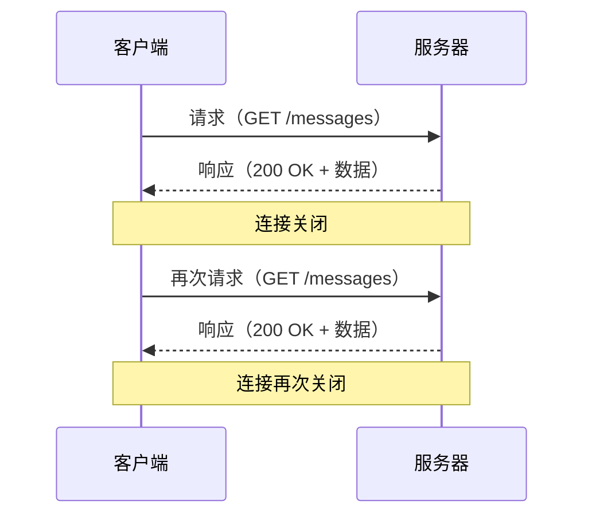
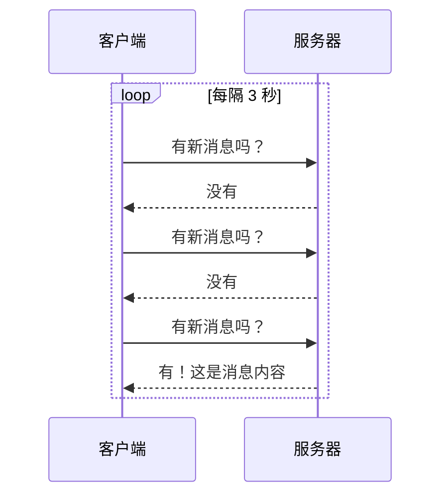
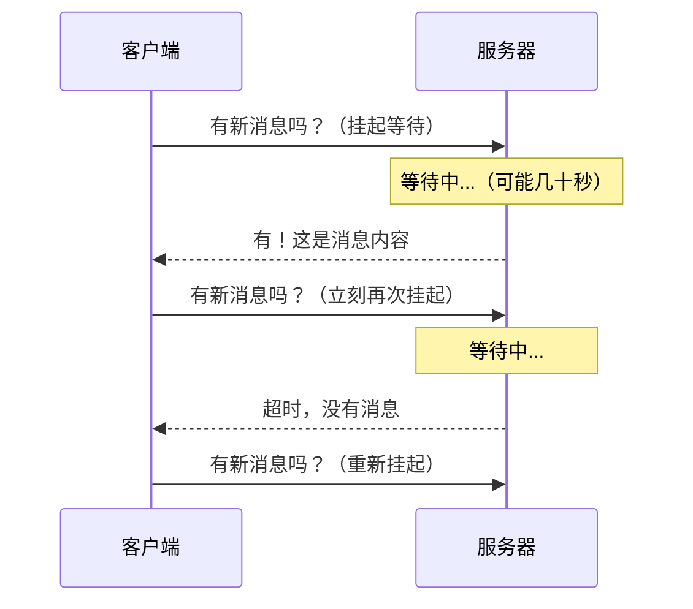
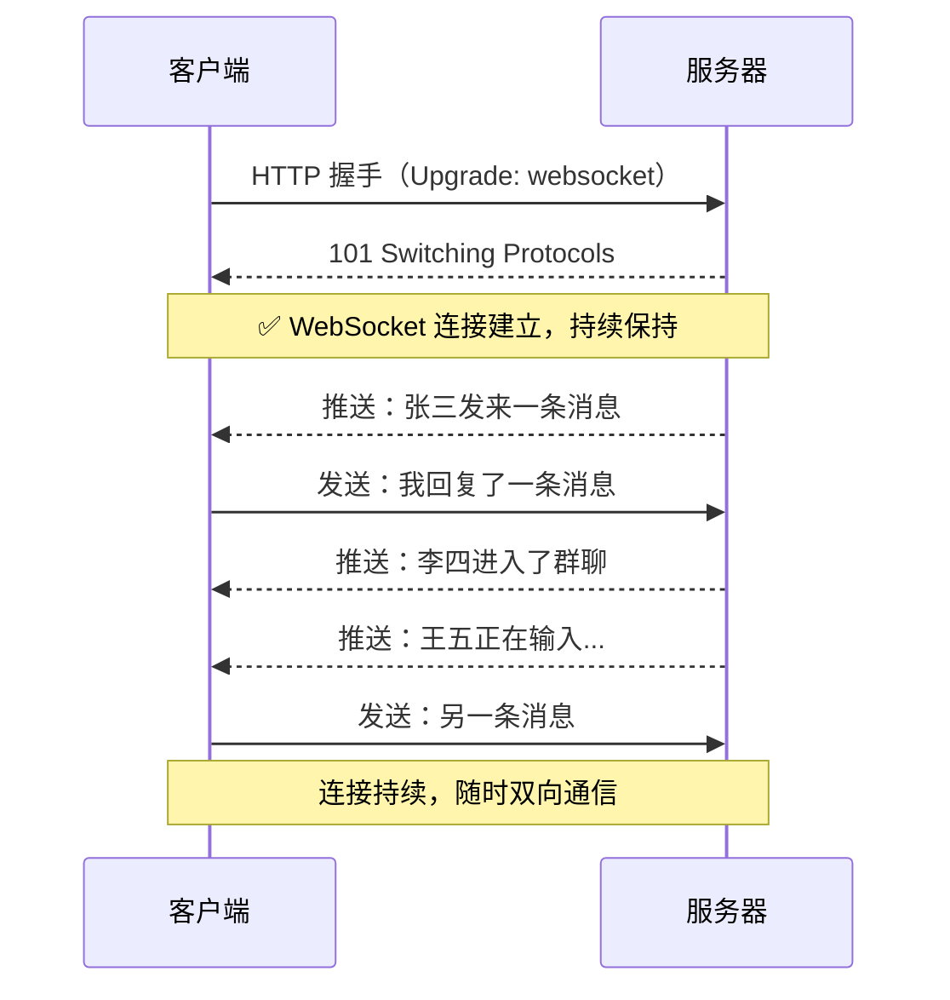
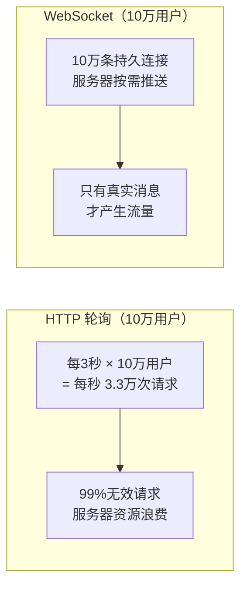

# WebSocket vs HTTP：为什么 IM 产品必须用 WebSocket

## 一句话结论

HTTP 是"你问我答"，WebSocket 是"保持通话"。IM 产品需要服务器主动推送消息，HTTP 做不到这件事。

---

## 1. HTTP 是怎么工作的

HTTP 的本质是**请求-响应模型**：客户端发起请求，服务器返回结果，连接随即关闭。每一次通信都是独立的、短暂的。

**关键限制：服务器永远无法主动联系客户端。** 只有客户端先"敲门"，服务器才能说话。

---

## 2. 用 HTTP 实现"实时"消息的代价

在 WebSocket 出现之前，开发者用两种方式绕过这个限制：

### 方式一：轮询（Polling）

客户端每隔几秒问一次服务器："有新消息吗？"

**问题：**
- 消息延迟取决于轮询间隔，间隔 3 秒就最多延迟 3 秒
- 99% 的请求都是无效的（没有新消息）
- 大量无效请求白白消耗服务器资源和用户流量

### 方式二：长轮询（Long Polling）

客户端发出请求后，服务器"憋着不回"，等到有新消息才响应。

**问题：**
- 每次响应后必须立刻重新建立连接，开销大
- 服务器需要维持大量"挂起"的连接，内存压力高
- 实现复杂，容易出现消息丢失或重复

---

## 3. WebSocket 是怎么工作的

WebSocket 在 HTTP 握手的基础上**升级为持久双向连接**。连接建立后，客户端和服务器都可以随时向对方发送数据，直到任意一方主动断开。

**核心优势：一次握手，持续通信。服务器可以随时主动推送。**

---

## 4. 两者的直观对比

| 对比维度 | HTTP | WebSocket |
|---|---|---|
| 通信方向 | 单向（客户端 → 服务器） | 双向（任意一方均可发起） |
| 连接方式 | 每次请求新建连接 | 一次握手，持久连接 |
| 服务器推送 | ❌ 不支持 | ✅ 原生支持 |
| 消息延迟 | 高（取决于轮询频率） | 极低（毫秒级） |
| 协议头开销 | 每次请求携带完整 HTTP 头（几百字节） | 帧头仅 2~10 字节 |
| 适用场景 | 查询数据、提交表单、加载页面 | 聊天、通知、实时协作、游戏 |

---

## 5. 为什么 IM 产品必须用 WebSocket

IM 产品有三个核心需求，HTTP 全部无法满足：

### 需求一：消息实时到达

用户发出消息后，对方必须**立刻**收到，而不是等几秒后轮询到。WebSocket 让服务器在消息入库的瞬间就推送给接收方，延迟在毫秒级。

### 需求二：在线状态感知

"对方正在输入…"、用户上线/下线通知，这些都是服务器主动推送的事件。HTTP 无法做到，WebSocket 天然支持。

### 需求三：高并发低开销

一个有 10 万在线用户的 IM 产品，如果用轮询（每 3 秒一次），每秒就有约 **3.3 万次** HTTP 请求打到服务器，其中绝大多数是无效的。WebSocket 下，10 万用户只需维持 10 万条持久连接，服务器按需推送，资源消耗大幅降低。

---

## 6. 在本项目中的应用计划

当前项目（Flash IM）的 HTTP 接口适合保留用于：
- 登录 / 注册
- 加载历史消息（分页）
- 上传文件 / 图片

需要迁移到 WebSocket 的功能：
- 实时收发消息
- 消息已读回执
- 用户在线状态
- "对方正在输入"提示

服务端技术栈（Rust + Axum）原生支持 WebSocket，迁移成本低。
