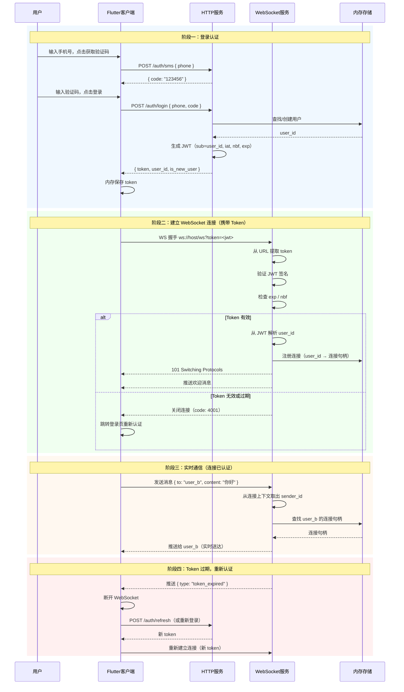

# WebSocket 身份认证流程

> 描述 JWT 认证与 WebSocket 连接如何在 IM 产品中协同工作

---

## 核心问题

WebSocket 是持久连接，一旦建立就可以双向通信。但服务器必须知道"这条连接属于谁"，否则无法：

- 把消息路由给正确的用户
- 隔离不同用户的会话数据
- 拒绝未登录用户的连接

HTTP 请求每次都带 `Authorization` header 很自然，但 WebSocket 握手阶段**浏览器不允许设置自定义 header**，所以需要特殊处理。

---

## 方案：Token 通过 URL 参数传递

```
ws://host/ws?token=<jwt>
```

服务器在 WebSocket 握手阶段从 URL 中提取 token，验证通过才升级协议，否则直接拒绝连接。

---

## 完整时序图



---

## 各阶段说明

### 阶段一：登录获取 Token

和普通 HTTP 认证完全一样。登录成功后，JWT Token 保存在客户端内存中，后续所有请求（HTTP 和 WebSocket）都使用这个 Token。

### 阶段二：建立 WebSocket 连接

这是关键阶段。由于浏览器的 WebSocket API 不支持自定义 header，Token 通过 URL query 参数传递：

```
ws://localhost:3000/ws?token=eyJ0eXAiOiJKV1Qi...
```

服务器在 HTTP → WebSocket 协议升级之前完成 Token 验证：
- 验证通过 → 升级协议，记录 `user_id` 与连接的绑定关系
- 验证失败 → 拒绝升级，返回 4001 关闭码

**连接建立后，user_id 就绑定在这条连接上**，后续所有消息都不需要再带 Token。

### 阶段三：实时通信

连接建立后，服务器从连接上下文中直接取出 `user_id`，无需每条消息都验证 Token。这是 WebSocket 相比 HTTP 的优势：**一次认证，持续通信**。

### 阶段四：Token 过期处理

Token 有有效期（本项目 7 天）。过期时有两种处理方式：

| 方式 | 说明 |
|---|---|
| 服务端主动推送 | 服务器检测到 Token 即将过期，推送 `token_expired` 事件 |
| 客户端定时检查 | 客户端在本地检查 Token 的 `exp` 字段，提前刷新 |

---

## 与当前项目的对应关系

| 现有模块 | 对应阶段 |
|---|---|
| `AuthApi.login()` | 阶段一：获取 Token |
| `HeartbeatApi.connect()` | 阶段二：建立连接（待改造，加入 token 参数） |
| `server/src/auth.rs` | 阶段一：登录接口 |
| `server/src/jwt.rs` | 阶段二：Token 验证逻辑 |
| `server/src/ws.rs` | 阶段二/三：WebSocket 处理（待改造，加入认证） |

---

## 下一步：改造 WebSocket 支持认证

服务端 `ws.rs` 需要：

```rust
// 从 URL 参数提取 token
async fn ws_handler(
    ws: WebSocketUpgrade,
    Query(params): Query<HashMap<String, String>>,
    State(state): State<AppState>,
) -> impl IntoResponse {
    let token = params.get("token").cloned().unwrap_or_default();

    // 验证 token
    match verify_token(&token, &state.jwt_secret) {
        Ok(claims) => ws.on_upgrade(move |socket| handle_socket(socket, claims.sub)),
        Err(_) => StatusCode::UNAUTHORIZED.into_response(),
    }
}
```

客户端 `HeartbeatApi` 需要：

```dart
// 连接时携带 token
final uri = Uri.parse('ws://localhost:3000/ws?token=$token');
_channel = channelFactory(uri);
```
