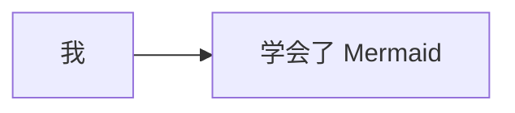
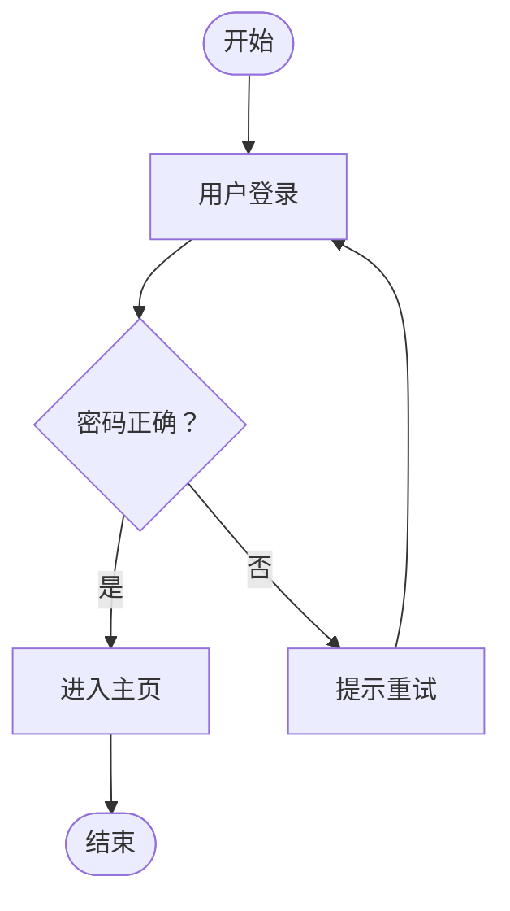
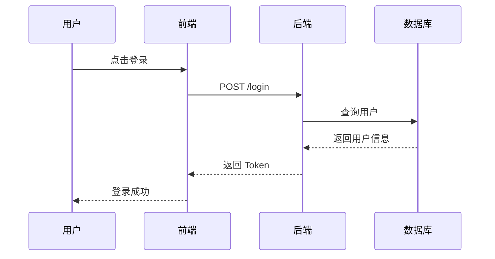
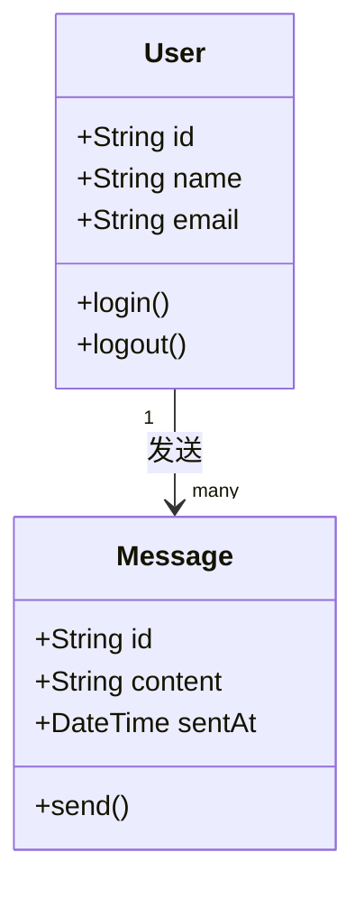
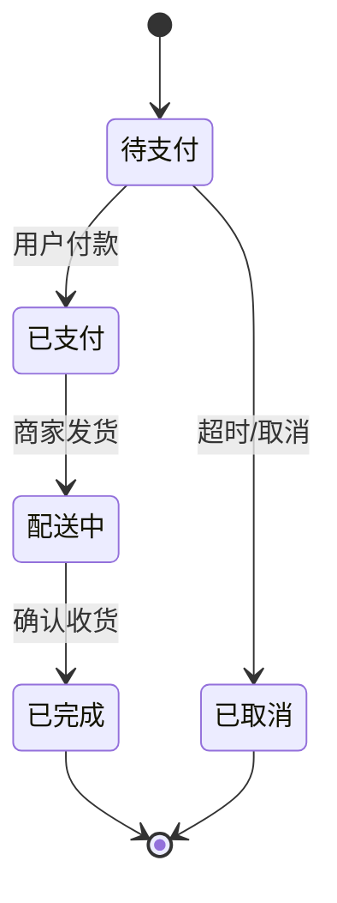
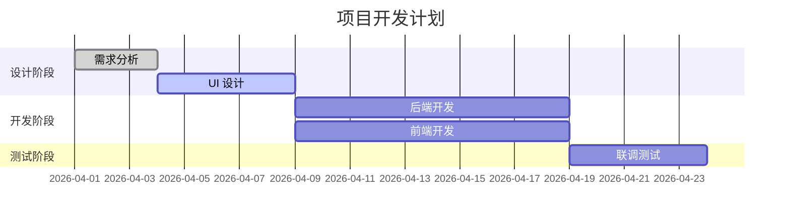
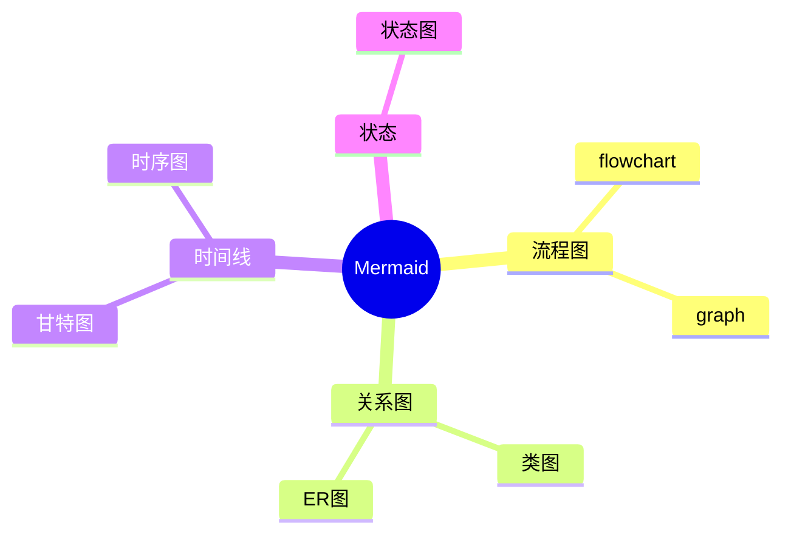
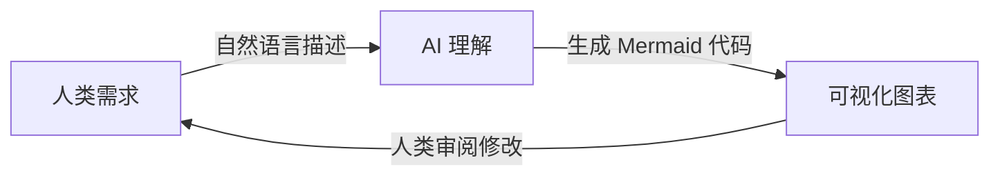
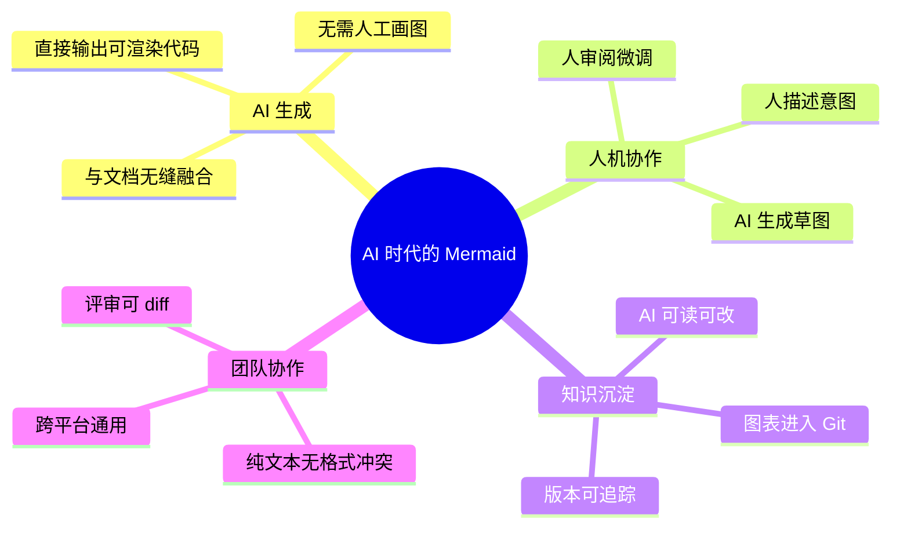

# Mermaid 入门指南：用文字画图的魔法

> 写给完全没听说过 Mermaid 的朋友

---

## 你好，我是 Mermaid

想象一下，你不需要打开任何画图软件，不需要拖拽方框、连线、对齐，只需要像写文章一样**打几行字**，一张漂亮的流程图就出现了。

这就是 Mermaid。

它是一种"图表描述语言"——你用简单的文字描述图的结构，它帮你渲染成图。就像 Markdown 让你用 `**粗体**` 写出 **粗体** 一样，Mermaid 让你用文字"写"出图表。

---

## 为什么要用它？

传统画图的痛点你一定懂：

- 打开 draw.io / Visio，拖了半小时，图还没画完
- 改了需求，图要重画，对齐又乱了
- 发给别人，对方没装软件，打不开
- 放进文档，图片模糊，或者和文字脱节

Mermaid 完全绕开这些问题：

- 纯文本，放进任何 Markdown 文件就能用
- 改逻辑只需改几个字，图自动更新
- GitHub、GitLab、Notion、Obsidian 原生支持渲染
- 和代码一起放进 Git，版本可追踪

---

## 第一张图，三行搞定

在任何支持 Mermaid 的地方，写这个：

````

````

你会得到：


就这么简单。`graph LR` 表示"从左到右的流程图"，`A --> B` 表示 A 指向 B，方括号里是节点的文字。

---

## 图表类型速览

Mermaid 支持十几种图表类型，下面是最常用的几种。

### 1. 流程图 (Flowchart)

描述步骤、判断、分支，最常用。



写法：
- `TD` = Top Down 从上到下，`LR` = Left Right 从左到右
- `[]` 矩形，`()` 圆角，`{}` 菱形判断，`([])` 胶囊形
- `-->|文字|` 在箭头上加标签

---

### 2. 时序图 (Sequence Diagram)

描述多个角色之间的交互顺序，适合画 API 调用、用户操作流程。



`->>` 是实线箭头，`-->>` 是虚线（通常表示返回/响应）。

---

### 3. 类图 (Class Diagram)

描述对象结构和关系，写代码设计时很有用。



---

### 4. 状态图 (State Diagram)

描述一个事物的状态变化，适合画订单状态、连接状态等。



---

### 5. 甘特图 (Gantt)

项目排期、任务时间线。



---

### 6. 思维导图 (Mindmap)



---

## 语法速查卡

```
# 流程图方向
TD / TB  从上到下
BT       从下到上
LR       从左到右
RL       从右到左

# 节点形状
[文字]      矩形
(文字)      圆角矩形
([文字])    胶囊形（开始/结束）
{文字}      菱形（判断）
((文字))    圆形
>文字]      旗帜形

# 连线类型
-->         实线箭头
---         实线无箭头
-.->        虚线箭头
==>         粗线箭头
-->|标签|   带文字的箭头
```

---

## 在哪里用？

| 平台 | 支持情况 |
|------|----------|
| GitHub / GitLab | ✅ 原生渲染 |
| Notion | ✅ 原生支持 |
| Obsidian | ✅ 原生支持 |
| VS Code | ✅ 安装插件 Markdown Preview Mermaid |
| Typora | ✅ 原生支持 |
| 在线编辑器 | ✅ [mermaid.live](https://mermaid.live) |
| Confluence | ✅ 插件支持 |

推荐新手先去 [mermaid.live](https://mermaid.live) 玩，左边写代码，右边实时预览，零门槛上手。

---

## Mermaid 在 AI 时代的重要性

这部分值得单独说，因为它真的很关键。

### AI 能"说出"图表，但不能"画出"图表

ChatGPT、Claude、Kiro 这些 AI，本质上是文字模型。它们可以生成文字、代码，但无法直接生成图片文件。

然而，**Mermaid 是文字**。

这意味着 AI 可以直接生成 Mermaid 代码，而这段代码就是一张图。AI 和人类之间，第一次有了一种通用的"图表语言"。



### 三个具体场景

**场景一：AI 辅助架构设计**

你告诉 AI："帮我画一个用户登录的时序图"，AI 直接输出 Mermaid 代码，粘贴进文档就是图。不需要截图，不需要导出，文档和图表永远同步。

**场景二：代码即文档**

Mermaid 图表和代码一起存在 Git 仓库里。AI 修改了代码逻辑，同时更新 Mermaid 图，文档永远不会过时。这在传统图片时代几乎不可能做到。

**场景三：AI 读懂你的图**

反过来，你把 Mermaid 代码给 AI，AI 能精确理解你的系统结构，给出更准确的建议。比起描述"有个用户服务连着数据库"，直接给一张 Mermaid 架构图，AI 的理解质量天壤之别。

### 为什么说它是 AI 时代的"通用图表语言"



在 AI 大量参与软件开发的今天，**能被 AI 生成、能被 AI 理解、能被人类直接阅读的图表格式**，就是最有价值的格式。Mermaid 恰好满足这三点。

它不只是一个画图工具，它是 AI 时代人机协作的可视化接口。

---

## 新手上路建议

1. 先去 [mermaid.live](https://mermaid.live) 玩 10 分钟，感受一下
2. 从 `flowchart` 开始，画你最熟悉的一个流程
3. 遇到不会的语法，直接问 AI："帮我用 Mermaid 画一个 XXX 图"
4. 把它加进你的日常文档习惯，替代截图和 PPT 里的流程图

你会发现，画图这件事，从此变得和写字一样自然。

---

> 官方文档：[mermaid.js.org](https://mermaid.js.org)  
> 在线编辑器：[mermaid.live](https://mermaid.live)
